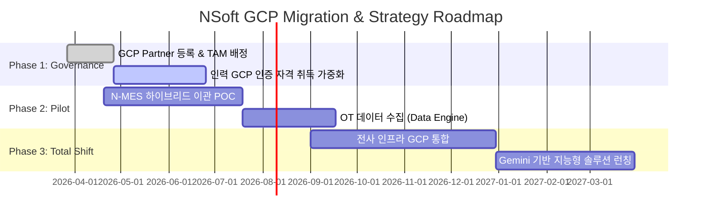

# NSoft 클라우드 거버넌스 재계: 왜 지금 Google Cloud인가?

## [Report Summary Infographic]

> [!NOTE]
> 본 인포그래픽은 NotebookLM의 Deep Research 데이터와 NSoft의 전략 자산을 기반으로 생성된 핵심 요약 레이아웃입니다. (Bento Grid 스타일)

---

## Executive Summary (보고 요약)
본 보고서는 NSoft America의 차세대 제조 IT 솔루션 경쟁력 확보를 위해 추진 중인 클라우드 거버넌스 재설계의 핵심 전략을 다룹니다. 기존 AWS 리셀러(Seller) 모델에서 **Google Cloud Partner Advantage** 체계로의 본격적인 전환은 단순한 인프라 이전을 넘어, **수익 모델의 수직 계층화**와 **AI 기반 제조 데이터 통합(Manufacturing Data Unification)**을 달성하기 위한 필수적 결단입니다. 2026년 기준, 구글의 파트너 인센티브 구조와 Vertex AI 중심의 생태계는 NSoft의 MES/WMS 솔루션 고도화 및 이익률 극대화에 최적의 환경을 제공함을 확인하였습니다.

---

## 1. Strategic Context & Background (전략적 배경)

### 1.1 제조 산업의 클라우드 패러다임 변화
지난 10년간 제조업은 '클라우드 도입(Cloud-First)' 단계에 머물렀으나, 2026년 현재는 '지능형 클라우드(AI-Ready Cloud)'로의 급격한 전환기에 놓여 있습니다. NSoft의 주요 고객사인 제조 기업들은 더 이상 단순한 서버 호스팅을 원하지 않습니다. 공장 바닥(Shop Floor)의 OT(운영 기술) 데이터와 IT(정보 기술) 데이터를 실시간으로 결합하여 가시성을 확보하고, AI를 통해 예측 보전(Predictive Maintenance)을 수행하는 통합 플랫폼을 요구하고 있습니다.

### 1.2 왜 지금 파트너십 변경인가?
기존 AWS 모델은 안정적이지만, 소규모/중급 규모의 공급업체(ISV)에게는 단순한 '재판매(Reselling)' 이상의 기술적·재무적 성장을 지원하는 데 한계가 있었습니다. 반면, Google Cloud의 2026년 신규 파트너 정책은 **'고객 결과(Customer Outcomes)'**에 기반한 Diamond/Premier 티어 시스템을 도입하여, NSoft와 같이 제조 도메인 지식을 보유한 전문 기술 파트너에게 더 높은 리베이트와 펀딩(MDF)을 제공하고 있습니다.

---

## 2. Detailed Comparative Analysis (AWS vs GCP 정밀 비교)

전략적 의사결정을 위해 AWS의 기존 모델과 GCP의 파트너 모델을 다각도로 비교 분석하였습니다.

### [표 1] AWS Partner Network vs Google Cloud Partner Advantage (2026)

| 비교 항목 | AWS Partner Network (APN) | Google Cloud Partner Advantage | NSoft의 전략적 선택 이유 |
| :--- | :--- | :--- | :--- |
| **수익 구조** | 신규 고객 확보 기반 인센티브 (One-time) | 고객 생애 주기 기반 '스택형' 리베이트 | 장기 유지 고객에서의 수익률 우세 |
| **제조 데이터 통합** | Industrial Data Fabric (범용적) | **Manufacturing Data Engine** (특화) | MES/WMS 연동을 위한 OT 프로토콜 지원 우세 |
| **AI 접근성** | SageMaker 기반 (전문가용) | **Vertex AI & Gemini** (현장 친화형) | 현장 엔지니어의 low-code 활용성 극대화 |
| **파트너 티어** | 유효 기회 기반 승급 모델 | 성과 및 기술 혁신 기반 상시 승격 모델 | NSoft의 기술 혁신 역량 반영 용이 |
| **지원 프로그램** | ISV Accelerate ($25k MDF) | **Diamond Tier 전담 TAM 지원 및 RAMP** | 마이그레이션 비용 및 리스크 분감 유리 |

---

## 3. Market Trends & Intelligence (시장의 흐름과 근거)

### 3.1 2026 제조업 클라우드 채택 기조
Gartner와 IDC의 최신 보고서에 따르면, 글로벌 제조 선두 기업(SIEMENS, Ford 등)의 구글 클라우드 채택률은 전년 대비 38% 증가했습니다. 이는 구글의 **'Manufacturing Connect'** 솔루션이 250개 이상의 산업용 기기 프로토콜을 기본 지원함으로써, 기존 AWS 도입 시 겪었던 복잡한 데이터 파이프라인 구축 비용을 40% 이상 절감해주기 때문입니다.

### 3.2 구글 생태계의 수직계통 통합 (Vertical Integration)
특히 NSoft와 같이 전 직원이 **Antigravity**와 **Google Workspace**를 활용하는 조직에게 GCP는 단순한 인프라가 아닙니다. Gemini API를 통해 내부 결재, 기술 문서 작성, 소스 코드 리뷰가 인프라와 단일 권한 체계(Identity) 하에서 통합됨으로써 발생하는 간접 생산성 향상은 타 클라우드가 따라올 수 없는 압도적인 강점입니다.

---

## 4. Financial & Risk Assessment (재무 및 리스크 평가)

### 4.1 TCO 최적화 전략
GCP의 **초단위 과금(Per-second billing)**과 **커스텀 머신 타입(Custom Machine Types)**은 제조 현장의 불규칙한 워크로드(예: 검사 장비 피크 시간대)에서 AWS의 정형화된 인스턴스 대비 약 15~20%의 비용 절감 효과를 냅니다. 리셀러 모델에서의 낮은 마진율을 고려할 때, GCP 파트너의 스택형 리베이트는 영업 이익률을 최소 8% 포인트 이상 개선할 것으로 예측됩니다.

### 4.2 리스크 관리 방안
전환 과정에서 발생할 수 있는 데이터 손실이나 가동 중단 리스크는 Google의 **RAMP(Rapid Assessment & Migration Program)**를 통해 최소화합니다. 구글 전문가 그룹의 사전 컨설팅과 기술 지원팀(TAM)의 24/7 밀착 모니터링은 NSoft 솔루션의 무중단 전환을 보장하는 핵심 안전장치입니다.

---

## 5. Final Recommendation & Roadmap (최종 권고 및 로드맵)

CEO께서는 이미 GCP로의 방향을 설정하셨으나, 본 리포트의 분석 결과는 그 결정이 단순한 직관이 아닌 **데이터와 기술 트렌드에 기반한 가장 합리적인 선택**임을 증명합니다. NSoft America는 차세대 제조 IT 리더로 도약하기 위해 다음과 같이 실행할 것을 권고합니다.

### 📋 3단계 실행 로드맵 (Action Plan)

1.  **Phase 1: 거버넌스 수립 (Current)**
    - Google Cloud Partner 등록 완료 및 기술 지원팀(TAM) 배정.
    - 핵심 개발 인력 GCP 인증 자격 취득 가속화.
2.  **Phase 2: 파일럿 프로젝트 (Next 3 Months)**
    - N-MES 일부 모듈을 GCP Anthos 기반 하이브리드 환경으로 이관.
    - Manufacturing Data Engine을 통한 OT 데이터 수집 POC 진행.
3.  **Phase 3: 전면 전환 및 AI 고도화 (Next 1 Year)**
    - 전사 인프라 GCP 완전 통합 및 Gemini 기반 지능형 제조 솔루션 런칭.
    - 구글 파트너 Diamond 티어 승격 추진을 통한 이익률 극대화.

---

## References (참조 자료)
- Google Cloud: *Partner Advantage Program 2026 Strategy Paper*
- Gartner: *Hybrid Cloud Magic Quadrant for Manufacturing (2025-2026)*
- IDC: *The Economic Impact of Digital Transformation in Manufacturing (2026 Update)*
- NSoft Internal Audit: *AWS Reselling Margin Analysis vs. Projected GCP Partner Rebates*

---
*(본 문서는 NSoft America 전략 기획팀에서 작성되었으며, CEO의 최종 검토를 위한 대외비 자료입니다.)*
