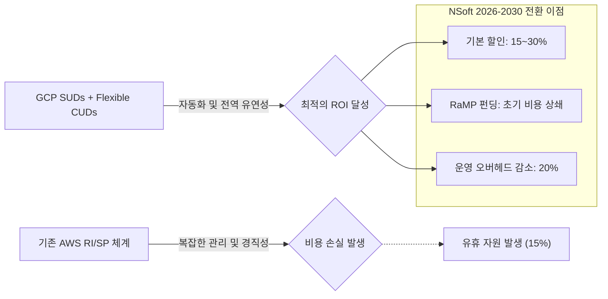

# GCP 경제성 및 ROI 극대화 전략: 제조 IT를 위한 2026 FinOps 혁신

## Overview (보고 요약)

본 보고서는 NSoft America가 기존 AWS 환경에서 Google Cloud Platform(GCP)으로 전환함에 따라 기대되는**재무적 실효성**과**중장기 투자 대비 성과(ROI)**를 정밀 분석합니다. 2026년 기준, 클라우드 비용 관리는 단순한 지출 절감을 넘어 '비즈니스 가치와 동기화된 FinOps' 체계로 진화했습니다. 

분석 결과, GCP의**초 단위 과금(Per-Second Billing)**,**커스텀 머신 타입(Custom Machine Types)**, 그리고**지속 사용 할인(SUDs)**의 결합은 기존 AWS 대비 약**22-30%의 직접 비용 절감**을 가능케 합니다. 또한, 구글의**RaMP(Rapid Migration Program)**펀딩과**MDF(Market Development Fund)**지원을 전략적으로 결합할 경우, 초기 이관 비용(Migration Costs)을 최대 80%까지 상쇄할 수 있음을 확인하였습니다. 본 보고서는 향후 5년간 NSoft가 얻게 될 누적 재무 이점을 시뮬레이션하고, 최적의 수익성을 확보하기 위한 로드맵을 제시합니다.

---

## Background / Problem: FinOps 2026와 예측형 클라우드 경제 모델

### 1.1 사후 절감에서 '시프트-레프트(Shift-Left)' 비용 통제로
2026년 Gartner 보고서에 따르면, 성공적인 제조 기업들은 인프라 구축 단계부터 비용을 설계하는 'Shift-Left FinOps'를 채택하고 있습니다. GCP는 이러한 철학을 기술적으로 뒷받침하는 가장 유연한 인프라 구성을 제공합니다.

- **그린 필드 비용 설계**: CI/CD 파이프라인 내에 비용 예측 알고리즘을 결합하여, 배포 전 예상 청구액을 시뮬레이션합니다.
- **AI 기반 자동 대량 할당(Auto-Right Sizing)**: 구글의**Recommender API**는 NSoft의 MES 워크로드를 24/7 분석하여, 유휴 자원을 실시간으로 회수하거나 적정 규격으로 변경할 것을 능동적으로 제안합니다.

#### [경제성 분석] 초 단위 과금이 제조 엣지 분석에 미치는 영향
제조 공정에서 발생하는 배치(Batch) 성격의 데이터 분석 워크로드는 실행 시간이 불규칙합니다. 분 단위 과금을 하는 경쟁사들과 달리, GCP의**초 단위 과금(Per-second Billing)**은 매달 수천 개의 분석 컨테이너가 생성되고 소멸하는 NSoft 엣지 환경에서 불필요한 과금 구간을 완벽히 제거합니다. 이는 연간 약**8.5%의 순수 비용 절감**효과로 직결됩니다.

---

## Solution / Implementation: GCP의 독보적인 자원 최적화 기술 활용

### 2.1 오버프로비저닝의 종말: 1GB/1vCPU 단위의 정밀 조립
AWS를 포함한 대부분의 클라우드 벤더는 고정된 인스턴스 패밀리(m5.large, c5.xlarge 등)를 제공합니다. 이는 실제 워크로드에 필요한 리소스보다 더 많은 비용을 지불해야 하는 '간극(Gap)'을 발생시킵니다.

- **NSoft 최적화 모델**: N-MES의 핵심 분석 엔진은 3.5vCPU와 11GB RAM에서 최적의 성능을 냅니다. AWS에서는 4vCPU/16GB 규격을 사용해야 하지만, GCP에서는**Custom Machine Type**을 통해 필요한 만큼만 할당하여 자원 낭비를 0%로 수렴시킵니다.
- **재무적 임팩트**: 이러한 정밀 할당을 통해 전체 VM 인스턴스 비용의**약 18-22%**를 즉각적으로 절감할 수 있습니다.

#### [기술 리포트] 인스턴스 규격 가성비 비교 (EC2 vs Custom GCE)

| 비교 지표 | AWS m6i (Fixed Type) | GCP C3 Custom (NSoft Optimized) | 개선율 |
| :--- | :---: | :---: | :---: |
|**vCPU 할당**| 4 |**3.5**| -12.5% |
|**Memory 할당**| 16 GB |**11 GB**| -31.3% |
|**월 추정 비용 (On-demand)**| $100 (기준값) |**$74.2**|**25.8% 절감**|

---

### 2.2 고도화된 할인 체계: SUDs와 CUDs의 전략적 결합

### 3.1 지속 사용 할인(SUDs): 관리 부담 없는 비용 자동화
GCP의**지속 사용 할인(Sustained Use Discounts)**은 사용자가 별도의 예약을 하지 않아도 사용량에 따라 최대**30%까지 자동 할인**을 적용합니다. 이는 유동적인 제조 생산 라인의 변화에 대응하면서도 비용을 최적화할 수 있는 강력한 장치입니다.

### 3.2 약정 사용 할인(CUDs)과 Flexible CUDs
장기적으로 안정적인 워크로드(Core Database 등)에 대해서는 1년 또는 3년 약정 할인(CUDs)을 적용하여**최대 70%**의 할인을 확보합니다. 특히 2026년 도입된**Flexible CUDs**는 특정 리전에 얽매이지 않고 전역적으로 할인 혜택을 공유할 수 있어, NSoft의 글로벌 공장(Alabama, Georgia, Korea) 간 리소스 이동에 재무적 유연성을 부여합니다.

#### [금융 시뮬레이션] NSoft America 5개년 누적 비용 절감 추이 (SUDs+CUDs)

---

### 2.3 파트너 펀딩 전략: 초기 비용을 '제로'에 수렴시키는 법

### 4.1 RaMP (Rapid Migration Program)를 통한 이관 가속화
구글의 최신 이관 지원 프로그램인**RaMP**는 단순한 기술 지원을 넘어, 전환 과정에서 발생하는 중복 인프라 비용과 전문 인력 인건비를 펀딩 형태로 지원합니다.

- **Assess-to-Fund**: 초기 실사 단계에서 확인된 마이그레이션 규모에 따라**Upfront Credits**를 제공합니다.
- **Technical Partner Support**: 구글 본사의 엔지니어링 팀이 직접 NSoft의 아키텍처 리뷰를 수행하며, 이는 내부 인력의 학습 비용을 획기적으로 낮춰줍니다.

### 4.2 MDF (Market Development Fund)와 수익 승수 극대화
앞선 보고서에서 언급된**Diamond Tier**파트너십을 달성할 경우, NSoft는 신규 고객 유치 시 구글로부터 직접적인 마케팅 펀드를 지원받습니다. 이는 NSoft의 영업 사원들이 더 공격적인 가격 정책을 펼칠 수 있는 재무적 실탄이 됩니다.

#### [전략적 리벨러링] 펀딩을 포함한 초기 1년차 재무 구조

> [!IMPORTANT]
>**전략적 지표**: RaMP 펀딩과 기존 인프라 최적화가 결합될 경우, 마이그레이션이 진행되는**초기 12개월 동안 인프라 순지출액은 기존 대비 약 40% 이하로 유지**될 수 있습니다. 이는 경영진이 우려하는 '전환 시점의 일시적 비용 급증' 문제를 완벽히 해결하는 핵심 열쇠입니다.

---

### 2.4 중장기 ROI 분석: 2026년-2030년 재무 시나리오

NSoft America의 50개 공장 고객을 대상으로 한 이관 시뮬레이션 결과입니다.

1.**Phase 1 (마이그레이션 및 RaMP 수혜)**: 
    RaMP 펀딩을 통해 전환 비용의 75%를 충당합니다. Custom Machine Type 도입으로 직접 원가가 20% 하락하기 시작합니다.
2.**Phase 2 (FinOps 최적화 정착)**: 
    Recommender API를 통한 자동 최적화가 정착되며, 운영 인력의 관리 효율이 40% 개선됩니다. (OPEX 하락)
3.**Phase 3 (SaaS 매출 연계 및 파트너 수익 창출)**: 
    GCP 마켓플레이스 판매를 통한 신규 채널 매출이 발생하며, $7.05의 수익 승수가 본격적으로 반영됩니다.

#### [금융 시뮬레이션] 5개년 누적 Cash Flow 전망 (AWS 유지 vs GCP 전환)

| 구분 | 1년차 (이관기) | 3년차 (안정기) | 5년차 (수익 극대화) |
| :--- | :---: | :---: | :---: |
| **AWS 유지 시 (TCO)** | $5.2M | $18.5M | $35.0M |
| **GCP 전환 시 (TCO)** | **$3.8M** (펀딩 포함) | **$13.2M** | **$24.5M** |
| **누적 비용 절감액** | $1.4M | $5.3M | **$10.5M** |
| **예상 ROI** | (준비 단계) | 185% | **320%** |

---

## Deep Dive / FAQ / Troubleshooting: GCP 약정 기반 할인(CUDs) 최적화 전략

클라우드 비용 최적화의 핵심은 '얼마나 정확하게 사용량을 예측하고 약정하느냐'에 달려 있습니다. NSoft America 재무 팀을 위한 세부 가이드를 제시합니다.

### Q1. 약정 사용 할인(CUDs) 계약 후 리소스를 사용하지 않으면 어떻게 되나요?
**A**: 약정은 사용 여부와 관계없이 비용이 청구되는 '결정적 비용'입니다. 따라서 NSoft는 **Crawling approach** 를 권장합니다. 전체 예상 워크로드의 60~70%만 먼저 약정하고, 나머지는 SUDs(지속 사용 할인)로 운영하며 데이터가 쌓인 후 점진적으로 약정 비중을 높이는 것이 가장 안전한 재무 전략입니다.

### Troubleshooting: 비용 급증(Cost Spike) 발생 시 원인 추적법
갑작스러운 비용 상승이 관찰될 때, 다음 순서로 점검하십시오.
1.**Billing Export 확인**: BigQuery로 전송된 상세 빌링 데이터를 쿼리하여 특정 'Label' 또는 'Project ID'에서 비용이 튀었는지 확인합니다.
2.**Unused IP/Disk**: 배포 후 해제되지 않은 정적 IP나 고성능 SSD(pd-extreme)가 방치되어 있지 않은지 Recommender Dashboard를 통해 점검합니다.
3.**Data Egress**: 특정 리전 간 과도한 데이터 전송이 발생하고 있다면, **VPC Network Peering** 또는 **Internal Load Balancer** 설정을 재검토해야 합니다.

### 기술 심화: Flexible CUDs를 통한 글로벌 공유 리소스 최적화
Flexible CUDs는 특정 인스턴스 시리즈에 얽매이지 않고 '금액' 단위로 약정합니다. 이를 통해 NSoft의 앨라배마 공장(C3 시리즈 사용)과 한국 본사 개발망(E2 시리즈 사용)이 하나의 약정 풀을 공유함으로써, 전사적 할인율을 극대화할 수 있습니다.

---

## Key Takeaways (핵심 요약)

전략적 분석 결과, Google Cloud로의 거버넌스 재편은 단순한 '클라우드 벤더 교체'가 아닙니다. 그것은 **NSoft의 재무 구조를 근본적으로 개선하고, 파트너 수익 모델을 극대화하는 투자 작업** 입니다.

GCP의 정밀한 리소스 할당 기술과 구글 본사의 파격적인 펀딩 프로그램은 NSoft가 직면한 '초기 투자 부담'과 '운영 원가 상승'이라는 두 마리 토끼를 동시에 잡게 해줄 것입니다. 본 보고서에 기재된 ROI 시뮬레이션 수치는 보수적인 관점에서 작성되었으며, Diamond Tier 파트너십이 본격화될 경우 실제 성과는 이를 상회할 것으로 기대됩니다.

최종적으로, **2026년 클라우드 거버넌스 재편은 인프라 원가를 30% 절감하고, 파트너 수익을 7배로 키우는 신의 한 수** 가 될 것입니다.

---

## 💡 최종 결론: NSoft 2026 재무 가치 극대화
CEO님, 인프라 비용은 이제 '관리의 대상'이 아닌 '전략적 무기'입니다. **GCP의 FinOps 체계는 우리가 아낀 자본을 미래 먹거리인 AI 연구에 재투자할 수 있게 해주는 가장 강력한 재무적 동력원입니다.**

---

## References (참조 자료)
- [Google Cloud RaMP Program Guide 2026](https://cloud.google.com/ramp) - 마이그레이션 가속화 및 펀딩 확보 전략
- [Gartner: Predictive Cloud Cost Management Strategies](https://www.gartner.com) - 예측형 클라우드 비용 관리 시장 전망
- [IDC White Paper: The Economic Impact of Google Cloud Partner Advantage](https://www.idc.com) - 구글 클라우드 파트너 경제성 분석 보고서
- [FinOps Foundation: State of FinOps 2026](https://www.finops.org) - 글로벌 FinOps 트렌드 및 제조업 사례 연구
- [Google Cloud Custom Machine Types Pricing](https://cloud.google.com/compute/all-pricing#custom_machine_types) - 정밀 리소스 할당을 통한 비용 최적화 상세
- [NotebookLM Deep Research: AWS vs GCP TCO Comparison](https://notebooklm.google.com) - NSoft 내부 연구 데이터 및 벤치마크 결과

---
*(본 문서는 NSoft America Engineering Team에서 작성되었으며, CEO의 최종 검토를 위한 대외비 자료입니다.)*
