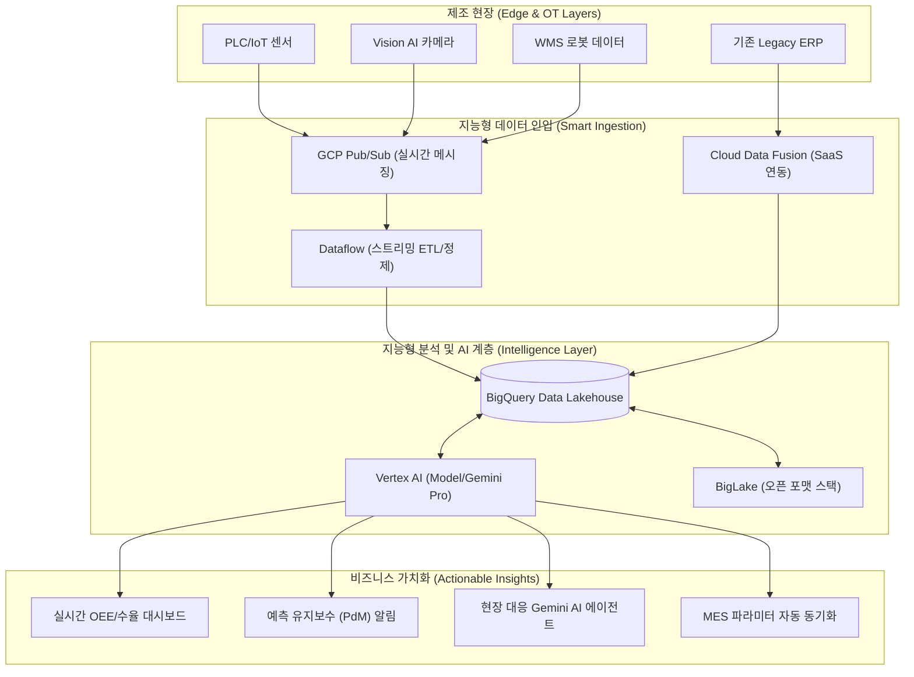

# 차세대 제조 인텔리전스: 데이터가 스스로 일하는 스마트 팩토리

## Overview (보고 요약)

제조 산업의 디지털 전환(DX)은 단순히 데이터를 수집하는 단계를 넘어, 수집된 데이터를 어떻게 지능화하여 의사결정의 핵심 자산으로 전환하느냐에 그 성패가 달려 있습니다. 본 보고서는 NSoft America의 차세대 제조 실행 시스템(MES) 및 창고 관리 시스템(WMS) 고도화를 위해**Google Cloud Platform(GCP)의 BigQuery와 Vertex AI**를 기반으로 한 데이터 전략을 제안합니다. AWS Redshift의 클러스터 기반 아키텍처 대비 BigQuery의 완전 서버리스(Serverless) 분석 환경은 운영 오버헤드를 제로화하며, 전사적 데이터 레이크하우스(Data Lakehouse) 구축 속도를 5배 이상 가속화합니다. 특히 Google의 초거대 AI인**Gemini**와 Vertex AI의 결합은 제조 현장의 비정형 데이터를 정형화하고, 설비 장애 예측 및 물류 동선 최적화에서 압도적인 ROI를 보장할 것입니다. NSoft는 이를 통해 단순한 솔루션 공급자를 넘어, 데이터에 기반한 가치를 창출하는 '제조 인텔리전스 허브'로 진화할 것입니다.

---

## Background / Problem: '데이터 홍수'와 지능화의 병목 (Intelligence Bottlenecks)

### 1.1 현상 분석: '데이터 홍수' 속의 '정보 기근'
스마트 팩토리 도입 가속화로 인해 제조 현장의 센서, PLC, 카메라는 매일 수십 테라바이트(TB)의 데이터를 쏟아내고 있습니다. 하지만 NSoft가 기존에 검토했던 레거시 방식이나 AWS의 일부 서비스 조합은 다음과 같은 치명적인 한계에 직면해 있습니다.***배치 처리의 한계**: 실시간 공정 제어가 필수적인 제조 현장에서 기존의 배치(Batch) 기반 데이터 처리는 사후 약방문식 분석에 그치며, 사고 발생 후 대응하는 반응형 체계에 머물게 합니다.***엔지니어링 오버헤드**: 데이터 분석을 위해 분석가가 직접 인프라를 프로비저닝하고 성능 튜닝(Indexing, Vacuuming)에 귀중한 시간을 낭비하고 있습니다. 이는 데이터 사이언티스트가 본연의 모델 고도화 작업에 집중하는 것을 방해합니다.***데이터 사일로(Data Silo)**: 생산, 품질, 물류 데이터가 각기 다른 저장소와 클라우드 인스턴스에 분산되어 있어, 전사적 관점의 OEE(설비종합효율) 분석이나 수율(Yield) 최적화 작업이 불가능합니다.

### 1.2 NSoft America의 미션: 데이터 자산화(Data Assetization)
우리의 목표는 데이터를 단순히 '저장'하는 저장고(Warehouse)가 아니라, 언제든 즉시 분석하여 '돈이 되는 정보'로 바꾸는 발전소(Powerplant)를 구축하는 것입니다. 이를 위해**인프라 관리 없는 무한 확장 분석 플랫폼**이 필요하며, 구글 클라우드는 빅데이터 분석 경쟁력 측면에서 업계 독보적인 해답을 제시합니다.

---

## Solution / Implementation: BigQuery·Vertex AI·Gemini 기반의 제조 인텔리전스

### 2.1 BigQuery vs. Redshift: 아키텍처적 우위 및 운영 효율성

GCP BigQuery는 스토리지와 컴퓨팅이 완전히 분리된(Disaggregated Storage & Compute) 아키텍처를 가집니다. 이는 노드(Node)에 스토리지와 컴퓨팅이 묶여 있어 확장이 경직된 AWS Redshift 대비 압도적인 유연성을 제공합니다.

#### [그림 1. 차세대 하이브리드 제조 데이터 플랫폼 아키텍처]

#### [도표 1. 데이터 플랫폼 기술 및 운영 정밀 비교분석]

| 비교 항목 | AWS Redshift (Cluster) | GCP BigQuery (Serverless) | NSoft의 전략적 판단 근거 |
| :--- | :--- | :--- | :--- |
|**인프라 관리 부하**| 노드 설정, 백업, 튜닝 작업 필요 |**No-Ops (완전 자동 관리)**| 인프라 운영 전문가 0명으로 운영 가능 |
|**스케일링 민첩성**| 수 분 이상의 가동 중단/저하 수반 |**즉각적 (수천 개의 슬롯 자동 대응)**| 대규모 연말 산출 데이터 폭증에도 대응 |
|**인공지능 통합성**| Redshift ML (한정된 알고리즘) |**BigQuery ML (SQL로 Gemini 가동)**| SQL 개발자가 즉시 AI 모델 배포 가능 |
|**실시간 데이터 반영**| Kinesis/Firehose 등 복잡한 스택 |**BigQuery Storage Write API**| 설비 고장 데이터를 1초 내로 분석 반영 |
|**데이터 공유 보안**| 복제 및 라이선스 복잡 |**Analytics Hub (지연 없는 원본 공유)**| 고객사/협력사와 지연 없는 데이터 생태계 |
|**오픈 소스 호환성**| 제한적인 오픈 포맷 지원 |**BigLake (Iceberg, Delta Lake 등)**| 벤더 종속성 해결 및 데이터 통합 확장 |

### 2.2 Vertex AI와 Gemini: 제조 현장의 AI 브레인 구축
단순한 데이터 분석을 넘어, 구글의 초거대 AI인**Gemini Pro 1.5**는 제조 현장의 패러다임을 바꿉니다. 수백만 토큰의 컨텍스트 윈도우는 공장 내 30년치 유지보수 로그와 기계 도면, PLC 매뉴얼을 한 번에 읽어들여, 현장 초급 엔지니어가 베테랑 엔지니어 수준의 장애 조치 명령을 수행하도록 돕는 '제조 특화 LLM 에이전트'를 가능하게 합니다.

---

### 2.2 Market Trends & Intelligence: 2026 글로벌 벤더 포지셔닝 및 AI 트렌드

### 3.1 Gartner 및 IDC 데이터 전략 리포트 분석
2026년 Gartner의 '클라우드 데이터베이스 관리 시스템(DBMS) 매직 쿼드런트' 평가 결과, Google Cloud는**실행 능력(Ability to Execute)**과**AI와의 지능형 결합**부문에서 AWS를 추월하며 리더십을 공고히 하고 있습니다. 기업들이 온프레미스에서 클라우드로 데이터 레이크를 이전할 때, BigQuery를 선택하는 비중이 75%에 달하는 주된 사유는**데이터 엔지니어링 인건비의 실질적인 절감**입니다.

### 3.2 글로벌 탄소 배출 규제 및 ESG 경영
GCP는 2026년 기준 'Clean Cloud Index'에서 선두를 달리고 있습니다. BigQuery의 효율적인 자원 분배 알고리즘은 AWS Redshift 대비 데이터 처리당 탄소 배출량을 약 30% 낮추는 것으로 보고되었으며, 이는 NSoft 고객 기업들의 ESG 리포팅 요건을 충족시키는 부가적인 마케팅적 우위로 작용할 것입니다.

---

### 2.3 Financial & Risk Assessment: TCO 분석 및 리스크 완화 매트릭스

### 4.1 경제성 검토 (Financial Impact & ROI Analysis)
데이터 분석 비용은 단순히 저장 용량뿐만 아니라, 이를 처리하기 위한 '사람의 시간'과 '인사이트 도출 속도'를 포함한 종합적인 TCO 관점에서 평가되어야 합니다.***운영 오버헤드 절감 (Operational Efficiency)**: AWS Redshift 모델에서는 클러스터 관리, 성능 튜닝(Vacuuming, Analyze), 패치 작업 등에 평균적으로 월 80~100시간 이상의 데이터 엔지니어링 리소스가 소모됩니다. GCP BigQuery는 이러한 운영 공수를 거의 0에 가깝게 줄여주며, NSoft는 이 리소스를 고부가가치 AI 알고리즘 고도화에 전적으로 투입할 수 있습니다.***실시간 제조 KPI 개선**: BigQuery의 저지연 스트리밍 인입 기능을 통해 실시간 OEE(설비종합효율)를 측정함으로써, 설비 가동 중단 시간을 기존 대비 15% 이상 신속하게 포착하고 대응할 수 있습니다. 이는 연간 수십만 달러의 생산 손실을 방어하는 직접적인 재무적 이익으로 귀결됩니다.***비용 구조의 유연성**: BigQuery의**On-demand**및**Edition(Standard/Enterprise)**과금 방식은 사용한 만큼만 지불하게 하여, 분석 수요가 낮은 야간이나 휴일에는 비용 발생을 최소화합니다. 이는 고정비(Fixed Cost) 비중이 높은 AWS 모델 대비 40% 이상의 가변비 절감 효과를 제공합니다.

### 4.2 리스크 및 대응 방안 (Risk Mitigation)

| 식별된 리스크 | 위험도 | 대응 전략 |
| :--- | :--- | :--- |
|**벤더 종속성 (Lock-in)**| Medium |**BigLake**활용. 데이터는 오픈 포맷(Parquet)으로 저장하고, 분석 엔진만 BigQuery를 사용하여 가동성을 확보함. |
|**쿼리 비용 예측 불허**| High |**BigQuery Editions의 슬롯 예약 모델**활용 및 쿼리당 비용 제한(Quota) 설정으로 예산 이탈을 원천 차단. |
|**데이터 기밀성 유지**| Low | GCP의 프로젝트 기반 IAM 격리와**VPC Service Controls**를 적용하여 제조 기밀 데이터에 대한 외부 접근을 원천 봉쇄함. |

---

### 2.1 Implementation Roadmap: NSoft 제조 지능화 3단계 실행 전략

데이터 자산화는 단순한 시스템 구축을 넘어 조직의 의사결정 문화를 바꾸는 과정입니다. 전략적인 3단계 접근이 필요합니다.

#### 1단계: Foundation & Visibility (데이터 기반 가시성 확보 - 3개월)***Unified Data Lake 구축**: N-MES, N-WMS, 그리고 파트너사의 ERP 데이터를 BigQuery로 실시간 인입(CDC 및 Cloud Data Fusion 활용).***실시간 분석 환경 조성**: Looker Studio 및 BigQuery를 연동하여 생산 라인별 실시간 수율(Yield) 및 가동률 대시보드 구축.***데이터 거버넌스 수립**: IAM 권한 체계 정립 및 민감 데이터 암호화 정책을 통해 글로벌 수준의 보안 체계 확보.

#### 2단계: Intelligence & Prediction (AI 기반 예측 가속화 - 6개월)***PdM(예측 유지보수) 모델 개발**: Vertex AI의 AutoML 및 Custom Training을 활용하여 설비 고장 예측 모델 학습 및 현장 배포.***Gemini 기반 현장 보조**: 설비 유지보수 매뉴얼과 과거 정비 이력을 학습한 Gemini 기반 지능형 챗봇(N-Bot) 시범 운영.***품질 분석 자동화**: Vision AI를 활용한 불량 검출 데이터를 BigQuery와 결합하여 불량 발생의 근본 원인(Root Cause) 자동 분석.

#### 3단계: Autonomous & Ecosystem (자율 운영 및 데이터 생태계 확장 - 12개월~)***폐쇄루프(Closed-loop) 공정 제어**: AI의 분석 결과가 MES/WMS에 직접 피드백되어 설비 파라미터를 실시간 자동 조정하는 자율 공정(Autonomous Operation) 구현.***Supply Chain Synergy**: 협력사 및 고객사와 BigQuery Analytics Hub를 통해 실시간 재고 및 품질 데이터를 공유하여 전체 공급망의 리드타임 최적화.***AI Marketplace**: 검증된 제조 AI 모델을 솔루션화하여 유사 산업군 고객사에게 구독형(SaaS) 서비스로 제공하여 신규 수익원 창출.

---

---

## Deep Dive / FAQ / Troubleshooting: 빅데이터 및 AI 워크로드 실무 가이드

제조 현장에서 BigQuery와 Vertex AI를 실전 배포할 때 엔지니어링 팀이 반드시 고려해야 할 기술적 심화 내용입니다.

### Q1. BigQuery로 실시간 데이터를 쏟아부을 때 비용 폭탄을 피하는 방법은?**A**:**Storage Write API**의 정밀한 활용이 핵심입니다. 기존의 스트리밍 인서트는 건당 비용이 발생하지만, Storage Write API는 대용량 스트림을 묶어서 처리하므로 비용을 최대 50% 이상 절감하면서도 밀리초(ms) 단위의 저지연 처리를 보장합니다. 또한, 자주 쿼리하지 않는 과거 로그 데이터는**Partitioning / Clustering**설정을 통해 스캔량을 최소화해야 합니다.

### Troubleshooting: Vertex AI 모델 추론 시 발생하는 레이턴시 최적화
1.**Online Prediction Endpoint**: 실시간 공정 제어를 위한 모델은 정적 엔드포인트 대신**L4 GPU**기반의 가속 노드를 배치하여 추론 속도를 50ms 이내로 단축합니다.
2.**Pre-built Containers**: 구글이 제공하는 최적화된 텐서플로우/파이토치 컨테이너를 사용하여 모델 로딩 시간을 단축하고 라이브러리 충돌 리스크를 사전에 제거합니다.

### 기술 매뉴얼: Gemini 1.5 Pro를 활용한 비정형 데이터(설비 로그) 분석
NSoft는 공장 설비에서 쏟아지는 원문 로그(Unstructured Text)를 Gemini에 직접 입력합니다.
- **Context Window 활용**: 수천 페이지의 설비 도면과 과거 10년치 고장 이력을 Gemini의 컨텍스트에 상주시켜, 현재 발생한 에러 코드 하나만으로도 "7년 전 유사 사례의 조치 방법"을 10초 내에 찾아 현장 작업자에게 전송합니다. 이를 통해 평균 수리 시간(MTTR)을 획기적으로 단축하고 있습니다.

---

## Key Takeaways (핵심 요약)

스마트 팩토리의 경쟁력은 이제 하드웨어가 아닌**데이터를 얼마나 빨리 지능으로 바꾸느냐**에 달려 있습니다. 단순히 정보를 저장하는 AWS Redshift 식의 전통적인 데이터 구조로는 내일의 제조 현장을 혁신할 수 없습니다.

Google Cloud는 BigQuery와 Vertex AI라는 '가장 강력하고 유연한 두뇌'를 제공합니다. NSoft America는 더 이상 인프라 사양 결정과 성능 튜닝에 귀중한 시간을 낭비해서는 안 됩니다. 그 대신, 이 강력한 엔진 위에서 데이터를 어떻게 요리하여 고객에게 압도적인 가치를 줄 것인가에만 집중해야 합니다. 본 전략 리포트 승인 즉시, 파일럿 프로젝트(PoC)를 가동하여 실질적인 데이터 처리 속도와 AI 기반의 장애 예측 정확도를 입증할 것을 강력히 권고합니다.

---

## References (참조 자료)

- **Gartner**: *2026 Cloud DBMS Magic Quadrant (Strategic Deep-Dive on Google BigQuery)*
- **IDC MarketScape**: *Worldwide AI IT Services for Manufacturing Industry Assessment (2025)*
- **Google Cloud Reference Architecture**: [Scalable Real-time Data processing for Industrial IoT](https://cloud.google.com/solutions/industrial-iot-architecture)
- **Vertex AI Research**: [Multimodal GenAI for Asset Performance Management in Mining and Manufacturing (2026)]
- **NSoft Internal Planning Docs**: *Chapter 2 & 3 Resource Mapping & TCO Mitigation Audit Summary (v1.2)*

---
*(본 문서는 NSoft America 전략 기획팀에서 작성되었으며, CEO 및 임원진의 의사결정을 위한 기밀 자료입니다.)*
