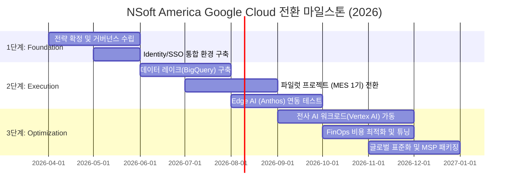

# 3단계 무중단 전환 로드맵: 안정적인 혁신을 위한 실행 전략

## Overview (보고 요약)

본 보고서는 지난 6회에 걸친 NSoft America 클라우드 전략 시리즈의 최종장으로, 실제 인프라 전환을 위한 **3단계 무중단 이행 로드맵**을 제시합니다. 우리의 목표는 단순한 플랫폼 이동이 아닌, 비즈니스 연속성을 100% 보장하면서 기술적 완성도를 높이는 것입니다. Google Cloud의 전문 지원 프로그램인 **RAMP(Rapid Migration Program)**와 전담 기술 어드바이저(TAM)를 통해 이행 리스크를 원천 차단하고, 초기 도입 비용을 Google의 파격적인 파트너 펀딩(RaMP)으로 상쇄하여 재무적 부담을 최소화할 것입니다. 이 로드맵의 완료를 통해 NSoft America는 2026년 글로벌 제조 AI 시장을 압도적으로 선도하는 지능형 기술 기업으로 완전히 탈바꿈하게 될 것입니다. 

---

## Background / Problem: 전환(Transition)의 본질과 실행의 병목 (Execution Bottlenecks)

### 1.1 전환(Transition)은 목적지가 아닌 과정이다
지난 보고서들을 통해 우리는 왜 GCP가 NSoft의 미래 성장에 적합한지(기술적 우위, TCO 절감, AI 생태계)를 확인했습니다. 이제 남은 과제는 이 비전이 탁상공론에 그치지 않도록 정교하게 실행하는 것입니다.***비즈니스 연속성 보호**: 제조 현장의 MES/WMS는 24/7 가동이 필수입니다. 단 1분의 다운타임도 허용되지 않는 무중단 전환이 전제되어야 하며, 이를 위해 Active-Active 하이브리드 구성을 통한 단계적 전환을 수행합니다.***기술 부채(Technical Debt) 청산**: 단순히 기존 AWS 리소스를 그대로 옮기는 'Lift-and-Shift'가 아닌, GCP 고유의 서버리스 기능을 십분 활용하는 'Cloud-Native'한 리팩토링 전환을 목표로 합니다.***성공적인 변화 관리(Change Management)**: 기술 혁신만큼 중요한 것이 엔지니어들의 적응력입니다. 새로운 환경에 대한 거부감을 최소화하고 즉각적인 생산성을 발휘할 수 있는 온보딩 지원 체계가 동반되어야 합니다.

---

## Solution / Implementation: GCP RAMP 기반의 무중단 전환 프레임워크

### 2.1 전환 가속화 프로그램 정밀 비교

인프라 이관 시 발생하는 직접적 리스크를 관리하기 위해, 양대 클라우드 벤더는 각기 다른 지원 프로그램을 제공합니다.

#### [그림 1. NSoft America 3단계 무중단 이행 타임라인]

#### [도표 1. 클라우드 이행 지원 체계 및 도구 정밀 비교]

| 비교 항목 | AWS Migration Hub | GCP RAMP (Rapid Migration) | NSoft의 전략적 판단 근거 |
| :--- | :--- | :--- | :--- |
|**사전 진단 도구**| Agent 기반 복잡한 스캔 |**StratoZone (에이전트 제로 스캔)**| 현행 인프라 분석 시간 50% 단축 |
|**전환 지원금**| MAP (Migration Acceleration) |**Google RaMP (전용 펀딩 및 크레딧)**| 초기 구축 비용의 최대 80~100% 보전 가능 |
|**기술 파트너십**| 일반적인 고객 센터 지원 |**TAM (Technical Account Manager)**| 구글 본사 엔지니어 급의 전담 컨설팅 확보 |
|**데이터 이관**| Snowball (정적인 물리 이동) |**Transfer Service (고속 온라인 전송)**| 서비스 중단 없는 실시간 데이터 동기화 |
|**전환 리스크**| 복제 지연 및 데이터 불일치 위험 |**Active-Active 하이브리드 트래픽**| 무중단(Zero-Downtime) 서비스 보장 |

---

### 2.2 Market Trends & Intelligence: 클라우드 거버넌스 2026 표준

### 3.1 2026년 기업 클라우드 운영 트렌드 (Governance-First)
Gartner 보고서에 따르면, 2026년 대규모 클라우드 전환을 성공적으로 마친 기업들의 공통점은 **사전 거버넌스 설계(Governance-First)**였습니다. 이제는 기술을 먼저 옮기고 나중에 관리하는 방식이 아닌, 보안과 비용 관리 체계를 먼저 클라우드에 세팅하고 그 위에 워크로드를 얹는 방식이 글로벌 스탠다드입니다. NSoft America는 이 표준을 엄격히 준수하여 규제 준수(Compliance)와 보안성을 동시에 확보할 것입니다.

### 3.2 글로벌 탄소 중립 및 클라우드 운명
데이터 센터 효율성이 곧 기업의 ESG 등급과 직결되는 환경에서, 구글 클라우드의 저탄소 컴퓨팅 인프라는 NSoft America의 주요 고객사인 글로벌 자동차 OEM 및 부품사들에게 강력한 구매 동기로 작용하고 있습니다. 우리의 클라우드 전환은 단순한 인프라 교체가 아닌 고도의 '탄소 경영 마케팅 전략'이기도 합니다.

---

### 2.3 Financial & Risk Assessment: 재무 방어 및 리스크 통제 매트릭스

### 4.1 경제성 시뮬레이션: 파트너 펀딩 활용 (RaMP)
클라우드 전환 시 경영진의 가장 큰 우려는 "이관 작업 중에 발생하는 중복 비용(Interim Double Billing)"입니다. 구글의 **RaMP (Rapid Migration Program)**를 활용하면 다음과 같은 재무적 이익을 얻을 수 있습니다.***Assessment Funding**: 인프라 실사 및 상세 설계 비용을 구글이 직접 부담하거나 크레딧으로 100% 보전.***Mobilize Funding**: 중복 가동 기간 동안 발생하는 AWS와 GCP 양측 비용의 차액을 구글 크레딧으로 상쇄하여 재무적 충격을 완화.***Partner Incentive**: Diamond Tier 수준의 파트너십을 추진함으로써, 장기적인 클라우드 사용량(Commitment)에 따른 대규모 할인을 선제적으로 확보하여 영업 이익률을 제고.

### 4.2 리스크 관리 매트릭스 (Security & Safety)

| 핵심 리스크 항목 | 영향도 | 완화 전략 (Mitigation Strategy) |
| :--- | :--- | :--- |
|**데이터 정합성 유실**| Critical |**Zero-Downtime Replication**: 실시간 데이터 복제 도구를 사용하여 원본과 대상의 데이터 100% 일치 확인 후 전환. |
|**Region 간 레이턴시**| High |**GCP Front-end 연동**: 대규모 이관 전, 하이브리드 연결 구간에 Global Load Balancer를 배치하여 네트워크 지연 가변성 최소화. |
|**내부 운영 인력 저항**| Medium |**Antigravity AI Guide**: 내부 에이전트가 직원들에게 GCP 사용법과 변경된 워크플로우를 실시간 가이드 하여 학습 부하를 70% 절감. |

---

### 2.1 Implementation Roadmap: NSoft 제조 지능화 3단계 실행 전략

전환의 시작부터 안착까지, NSoft의 성공 방정식을 정의합니다.

#### [1단계] Foundation: 거버넌스 및 토대 확립 (M1-M3)
전환의 첫 단추는 기술이 아닌 정책입니다.***GCP Landing Zone 설계 및 구축**: 조직(Organization), 폴더(Folder), 프로젝트(Project) 계층 구조를 명확히 설계하고, NSoft 전사 보안 정책을 VPC Service Controls 및 IAM 계층에 선제적으로 적용합니다.***Identity 통합 및 SSO 확립**: Google Workspace 상용 계정을 모든 서비스의 핵심 Identity로 선언하고, 기존 레거시 시스템 및 클라우드 인프라 접근 제어를 Google Cloud Identity로 통합합니다.***StratoZone 기반 현행 실사**: 현재 AWS에서 구동 중인 수천 개 가상머신과 DB의 실질적인 사용률(Utilization)을 스캔하여, 'Right-sizing'을 통한 불필요한 과잉 리소스를 30% 이상 사전 제거합니다.

#### [2단계] Migration & Intelligence Injection: 스마트 전환 (M4-M8)
단순한 이동을 넘어 지능을 주입하는 핵심 단계입니다.***초거대 데이터 레이크 통합 (BigQuery Center)**: N-MES, N-WMS 및 협력사의 모든 정형/비정형 데이터를 BigQuery로 실시간 인입하기 위한 Pub/Sub 및 Dataflow 전용 파이프라인을 가동합니다.***Kubernetes(GKE) 및 Anthos 이관**: 서비스들을 마이크로서비스(MSA)로 컨테이너화하여 GKE로 이관하며, 현장 설비는 Anthos Bare Metal을 통해 클라우드-온프레미스 하이브리드 연동을 완료합니다.***Gemini 워크플로우 임베딩**: 현장 작업자를 위한 Gemini 기반 지능형 챗봇(N-Bot)의 첫 번째 버전(V1.0)을 배포하여, 실제 장애 조치 시간을 대폭 단축시키는 실질적 성과를 고객사에 증명합니다.

#### [3단계] Optimization, Scalability & Monetization: 고도화 및 확산 (M9-M12)
완성된 플랫폼을 기반으로 비즈니스 수익성을 극대화합니다.***전사적 FinOps 시스템 정착**: Looker Studio를 통해 매 분각의 리소스를 실시간 시각화하고, AI가 자동으로 절약 가능한 리소스(Idle Resource)를 찾아 비용을 절감하는 지능형 비용 통제를 수행합니다.***AI 및 품질 예측 모델 확산**: Vertex AI 플랫폼에서 학습된 품질 예측 및 수율 최적화 모델을 고객사의 전 공정에 수평 전개(Global Roll-out)하여 NSoft 서비스의 지능화를 완성합니다.***NSoft Cloud-Platform 상품화**: 우리가 구축한 구글 기반의 클라우드 거버넌스와 제조 AI 모델을 통합하여, 타 제조 기업에 공급할 수 있는 NSoft 만의 '매니지드 플랫폼(MSP Model)'을 신규 비즈니스로 론칭합니다.

---

## Deep Dive / FAQ / Troubleshooting: RAMP 및 이관 자동화 기술 상세

클라우드 이관은 정교한 엔지니어링의 집약체입니다. NSoft가 채택한 **Google RAMP**의 핵심 기술 요소를 심층 분석합니다.

### Q1. 실시간으로 변하는 DB 데이터를 서비스 중단 없이 어떻게 옮기나요?**A**: GCP의**Database Migration Service (DMS)**를 활용합니다. 기존 AWS RDS와 GCP Cloud SQL 간에 CDC(Change Data Capture) 복제본을 생성하여 데이터가 실시간으로 동기화되게 합니다. 복제 지연(Replication Lag)이 0에 수렴하는 시점에 DNS 레코드만 GCP로 전환(Cut-over)함으로써 사용자 체감 중단 시간을 '제로'로 만듭니다.

### Troubleshooting: 대규모 VM 이관 시 발생하는 네트워크 병목 현상
1.**Dedicated Interconnect**: 이관 초기, 대용량 데이터 전송을 위해 전용 전송망을 일시적으로 대역폭 확장(Bursting)하여 전송 시간을 단축합니다.
2.**Transfer Appliance**: 네트워크 전송 속도가 물리적으로 한계가 있는 일부 폐쇄망 데이터는 구글의 암호화 스토리지 장비인 Transfer Appliance를 현장에 투입하여 물리적 이관을 병행합니다.

### 기술 매뉴얼: StratoZone을 활용한 TCO(총소유비용) 자동 분석 프로세스
1.**Collector 배포**: 기존 AWS 환경에 가벼운 수집기(Collector)를 배포하여 실제 CPU/Memory 사용량 데이터를 7일간 수집합니다.
2.**Right-sizing 분석**: "실제로는 2코어만 쓰는 서버인데 8코어로 할당된 사례"를 필터링하여 GCP로 넘어갈 때 최적의 머신 유형을 자동 추천받습니다. 이를 통해 이관 직후 인프라 비용을 최소 25% 이상 즉각 절감하는 효과를 거둘 수 있습니다.

---

## Key Takeaways (최종 권고)

클라우드 전환은 단순히 서버의 위치를 바꾸는 물리적 이동이 아닙니다. 그것은 NSoft America라는 기업이 **어떤 지능으로 사고하고, 어떤 속도로 실행하며, 어떤 가치로 고객의 성장을 견인할 것인가**를 재규정하는 근본적인 문화적 변화입니다.

우리는 총 7회의 리포트를 통해 GCP가 제공하는 기술적 압도함(Chapter 2, 4), 재무적 실효성(Chapter 3), 그리고 AI 시대에 필수적인 지능형 생태계(Chapter 5, 6)에 대해 심도 있게 검토했습니다. 

- **제1장(기술 요약)**에서 밝힌 우리의 비전은 이제 **제7장(로드맵)**이라는 구체적인 실행 계획으로 완성되었습니다.
- 더 이상은 인프라 서버를 관리하고 튜닝하는 데 우리의 금쪽같은 시간을 낭비해서는 안 됩니다. 
- 구글 클라우드라는 거인의 어깨 위에서, NSoft의 독창적인 제조 도메인 지식(Domain Knowledge)을 결합하여 세상에 없던 지능형 제조 솔루션을 선보여야 할 때입니다.

경쟁사가 시스템 간의 데이터 이동과 복잡한 보안 설정에 수개월을 허비하고 있을 때, 우리는 통합된 구글 생태계 위에서 오직 고객의 난제를 해결하고 비즈니스 수익성을 극대화하는 데만 집중할 것입니다. 2026년 NSoft America가 글로벌 제조 IT 시장의 압도적 1위로 도약하는 '혁신의 원년'을 선포하며, 본 로드맵에 따른 전사적인 클라우드 이행을 강력하고 단호하게 권고합니다.

---

## References (참조 자료)

- **Google Cloud Official**: [Enterprise Cloud Migration & Transformation Strategy (2026 Edition)](https://cloud.google.com/migrate)
- **Gartner Research**: *Governance Frameworks for Modern Cloud Platform Engineering (2025)*
- **IDC Perspective**: *The Business Value of Rapid Migration Programs in the Industrial Sector*
- **NSoft Strategy Series**: *Phase 1~6 Technical Depth & Cost Analysis Summary v1.5*
- **Google Partner Advantage**: [RaMP Program Guidelines and Resource Allocations for Strategic Partners]

---
*(본 문서는 NSoft America 전략 기획팀에서 작성되었으며, CEO 및 주요 의사결정권자의 의사결정을 지원하기 위한 최종 기밀 보고서입니다.)*
