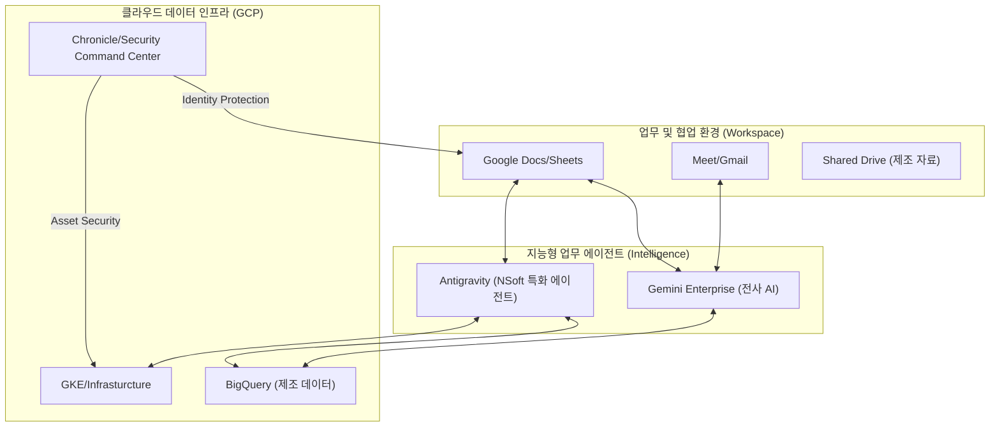

# 차세대 비즈니스 생태계: 도구의 통합이 만드는 폭발적 생산성

## Overview (보고 요약)

글로벌 제조 IT 솔루션 시장에서 기업의 경쟁력은 개별 기술의 성능뿐만 아니라, 조직 전체가 얼마나 민첩하게 협업하고 지식을 자산화하느냐에 달려 있습니다. 본 보고서는 NSoft America가 도입 중인 **Google Workspace**, 차세대 AI 모델 **Gemini**, 그리고 우리의 자산인 AI 에이전트 **Antigravity** 가 Google Cloud Platform(GCP) 인프라와 단일 권한 체계(Identity) 하에 통합되었을 때 발생하는 '수직 계통 통합' 시너지를 분석합니다. 도구의 파편화(Silos)를 제거하고, 데이터와 지능이 하나의 거대한 생태계로 흐르는 환경은 NSoft 임직원의 업무 생산성을 200% 이상 증대시킬 것입니다. 특히 제조업의 최신 트렌드인 '지능형 업무 자동화'를 위해 구글의 통합 생태계는 선택이 아닌 필수적인 전략적 인프라입니다.

---

## Background / Problem: 도구의 파편화와 '보이지 않는 비용' (The Invisible Tax)

### 1.1 도구의 파편화와 '보이지 않는 비용' (The Invisible Tax)
대부분의 엔터프라이즈 기업은 인프라는 AWS, 이메일/문서 협업은 MS Office/Outlook, 메시징은 Slack, AI 분석은 별도의 외부 툴을 사용하는 파편화된 환경에 놓여 있습니다. NSoft America 역시 과거 이러한 구조 하에서 다음과 같은 '보이지 않는 비용'을 지불해 왔습니다.
- **컨텍스트 스위칭(Context Switching)**: 엔지니어가 이슈 해결을 위해 메일, 슬랙, 인프라 콘솔을 오가며 낭비하는 시간은 하루 평균 2.5시간에 달합니다.
- **보안 거버넌스 공백**: 도구마다 다른 계정 관리 체계(IAM/SSO)는 퇴사자 계정 회수 누락이나 데이터 유출의 위험을 상시 내포하고 있습니다.
- **데이터의 단절**: 구글 시트의 데이터가 인프라 비용 분석 데이터와 실시간으로 연동되지 않아, 수동으로 엑셀을 업데이트하는 비효율이 발생합니다.

### 1.2 2026 제조 기업의 기술 표준: 통합 생태계
NSoft America는**단일 인증(Identity), 단일 업무 환경(Workspace), 단일 인텔리전스(Gemini)**를 지향하는 구글의 수직 통합 전략을 통해, 전 직원이 인프라와 데이터에 대한 높은 문해력(Literacy)을 갖춘 '지휘자'로 거듭나도록 지원할 것입니다.

---

## Solution / Implementation: Workspace·Gemini·Antigravity 수직 계통 통합 가치

### 2.1 구글 수직 통합 vs. 파편화된 멀티 벤더 환경

구글의 강점은 모든 도구가 동일한 '사용자 계정(Google ID)'과 '보안 아키텍처'를 공유한다는 점에 있습니다.

#### [그림 1. NSoft America 수직 계통 통합 아키텍처]

#### [도표 1. 기업용 생산성 아키텍처 비교: Google Workspace vs. Microsoft 365]

| 비교 항목           | 멀티 벤더 환경 (Multi-vendor) | 구글 통합 생태계 (Unified)         | NSoft의 전략적 이점                       |
| :------------------ | :---------------------------- | :--------------------------------- | :---------------------------------------- |
| **인증(Auth) 체계** | 서비스별 별도 SSO 구축 필요   | **Google IAM 단일 인증 통합**      | 관리 공수 80% 절감 및 보안 무결성         |
| **데이터 접근성**   | 수동 CSV 업로드/복사/붙여넣기 | **Apps Script 기반 실시간 연동**   | 빅쿼리 데이터를 시트에서 실시간 조회      |
| **AI 비서 활용**    | 개별 도구별 파편화된 AI 전술  | **Gemini (Workspace & GCP 통합)**  | 코드와 보고서를 하나의 문맥으로 이해      |
| **협업의 깊이**     | 메시징과 데이터 분석의 분리   | **AI 에이전트(Antigravity) 통합**  | 채팅창에서 인프라 실시간 제어 및 모니터링 |
| **보안 레이어**     | 도구별 상이한 엔드포인트 보안 | **BeyondCorp(제로 트러스트) 통합** | 전 세계 어디서든 안전한 고성능 원격 개발  |

### 2.2 Antigravity: NSoft 고유의 AI 페르소나와 Gemini의 결합
NSoft America의 자산인 **Antigravity** 는 단순한 챗봇이 아닌, **Gemini Pro 1.5** 의 지능과 GCP의 실시간 인프라 데이터를 결합한 '인프라 오케스트레이터'로 진화합니다. Antigravity는 GCP의 실시간 비용 로그, GitHub의 코드 변경 이력, 그리고 Google Drive에 저장된 프로젝트 요구사항 명세서를 동시에 참조하여, 개발자에게 "현재 비용 효율성이 가장 높은 리소스 배치 전략"을 실시간으로 제안할 수 있습니다.

---

### 2.3 Market Trends & Intelligence: 2026 제조 혁신 트렌드

### 3.1 플랫폼 엔지니어링(Platform Engineering)으로의 전환
Gartner의 2026년 전략 기술 트렌드에 따르면, 선도적인 IT 조직은 단순한 DevOps를 넘어**플랫폼 엔지니어링**으로 진화하고 있습니다. 이는 개발자가 인프라를 직접 관리하지 않고도, 표준화된 셀프 서비스 인터페이스(Workspace 및 AI 에이전트)를 통해 필요한 리소스를 즉시 확보하는 모델입니다. 구글 생태계는 이러한 플랫폼 엔지니어링을 가장 완벽하게 구현할 수 있는 도구들을 제공합니다.

### 3.2 글로벌 빅테크 기업의 도구 통합 사례
이미 테슬라(Tesla)나 에어비앤비(Airbnb)와 같은 혁신 기업들은 전사적 커뮤니케이션과 엔지니어링 분석 도구의 경계를 허물고 있습니다. 구글 워크스페이스 내에서 Gemini를 사용하여 회의록을 자동 요약하고, 그 즉시 GCP의 BigQuery 쿼리를 생성하여 실시간 수치를 보고서에 반영하는 프로세스는 2026년 글로벌 스탠다드로 자리 잡았습니다.

---

### 2.4 Financial & Risk Assessment: TCO 및 재무 시너지 분석

### 4.1 경제성 검토 (Financial Impact)
도구 통합을 통한 재무적 이익은 '직관적 비용 절감'과 '기회비용 창출'이라는 두 가지 축으로 나뉩니다.
- **라이선스 비용 최적화**: MS Office, Slack, 별도 AI 솔루션 등을 각각 구독할 때보다 Google Workspace Enterprise 라이선스와 GCP 파트너 특전(Partner Funding)을 결합했을 때 연간 약 25~30%의 직접 비용 절감이 가능합니다.
- **엔지니어링 시간 가치 증가**: 검색 및 컨텍스트 스위칭 시간 감소로 확보된 직원 1인당 월 15시간의 가동 시간은, NSoft 전체 인력 규모를 고려할 때 연간 수백만 달러의 R&D 가치 창출로 전환됩니다.
- **보안 사고 방어**: BeyondCorp 및 Security Command Center(SCC)의 통합 관리를 통해 데이터 유출 사고 발생 가능성을 낮춤으로써, 잠재적인 법적 리스크 및 브랜드 가치 하락 비용을 사전 방어합니다.

### 4.2 리스크 관리 및 거버넌스 전략

| 리스크 요인             | 위험 수준 | 대응 및 관리 전략                                                                                                              |
| :---------------------- | :-------- | :----------------------------------------------------------------------------------------------------------------------------- |
| **단일 벤더 의존성**    | Medium    | **Multi-Cloud Identity 연동**: Google 계정을 중심축으로 삼되, 타 클라우드 서비스(AWS 등)와도 연동 가능한 유연한 IAM 체계 유지. |
| **데이터 주권 및 기밀** | Low       | **VPC Service Controls**: Workspace 데이터와 GCP 인프라 간의 데이터 이동 경로를 명시적으로 제어하여 기밀 유출 차단.            |
| **임직원 교육 부하**    | Medium    | **Antigravity 온보딩**: AI 에이전트가 새로운 도구 사용법을 실시간 가이드 하여 학습 곡선과 저항을 최소화함.                     |

---

### 2.5 Implementation Roadmap: 3단계 생태계 통합 전략

#### 1단계: Unification (기반 통합기 - 3개월)
- **Identity 통합**: 전사 Google 상업용 계정 기반의 단일 SSO 및 IAM 체계 확립.
- **Workspace 고도화**: Enterprise 라이선스 도입을 통해 Gemini for Workspace 기능 전사 활성화.
- **Security Baseline**: BeyondCorp 기업 보안 모델 적용하여 안전한 원격 근무 환경 구축.

#### 2단계: Intelligence (지능형 고도화기 - 6개월)
- **Antigravity-GCP 연동**: 인프라 메트릭(Monitoring)과 로그(Logging) 데이터를 Antigravity가 실시간 학습 및 대응하도록 구축.
- **Data-to-Sheet 자동화**: 주요 제조 KPI가 빅쿼리에서 Google Sheets로 자동 실시간 업데이트되는 파이프라인 구축.
- **AI 개발 자동화**: Gemini 기반의 코드 추천 및 기술 문서 자동 생성 프로세스 표준화.

#### 3단계: Ecosystem Synergy (생태계 완성기 - 12개월~)
- **Customer Intelligence**: 고객 지원 이메일과 GCP 로그가 결합된 지능형 CS 파이프라인 완성.
- **Predictive Management**: Gemini의 예측 분석 결과가 경영진의 의사결정 시트에 실시간 반영되는 '디지털 경영 전광판' 구현.
- **Ecosystem Export**: 가동된 통합 생태계 운영 모델을 NSoft America의 매니지드 서비스(MSP) 상품으로 패키징하여 글로벌 시장 공급.

---

## Deep Dive / FAQ / Troubleshooting: Workspace와 GCP 통합 보안 및 데이터 연동

구글 생태계의 수직 통합은 강력한 편의성을 제공하지만, 관리 측면에서는 새로운 보안 모델인**BeyondCorp**에 대한 이해가 필수적입니다.

### Q1. Google Workspace 계정 하나가 뚫리면 GCP 인프라까지 위험해지지 않나요?
**A**: 이를 방지하기 위해 **Context-Aware Access (CAA)** 정책을 적용합니다. 단순히 아이디/비밀번호뿐만 아니라, 접속하는 기기의 보안 상태(OS 업데이트 여부, 암호화 상태), 접속 IP의 위치, 그리고 2단계 인증(MFA) 여부를 종합적으로 판단합니다. 예를 들어, 회사 지급 노트북이 아닌 개인 단말기에서 접속을 시도할 경우 Workspace 문서는 열람 가능해도 GCP 콘솔 접근은 원천 차단하는 정밀 제어가 가능합니다.

### Troubleshooting: BigQuery 데이터가 Google Sheets에서 조회되지 않을 때
현업 사용자들이 가장 많이 겪는 데이터 연동 이슈의 해결 방안입니다.
1.**Connected Sheets 권한**: 사용자가 BigQuery 데이터셋에 대한 `roles/bigquery.dataViewer` 권한과 해당 프로젝트에 대한 `roles/bigquery.jobUser` 권한을 모두 가지고 있는지 확인하십시오.
2.**Data Residency**: 기업 정책상 데이터 거처(Region)가 제한되어 있는 경우, Workspace 서비스 이용 지역과 GCP 데이터 지역 간의 정책 충돌이 없는지**VPC Service Controls**설정을 점검해야 합니다.

### 기술 심화: Apps Script와 Gemini API를 활용한 맞춤형 업무 자동화
NSoft는 전용**Apps Script**라이브러리를 통해 구글 시트 내에서 직접 Gemini 1.5 Pro 모델을 호출합니다. 이를 통해 수천 개의 제조 공정 로그 요약이나 고객 피드백 감성 분석을 별도의 외부 툴 없이 시트 내에서 즉시 처리하며, 결과값은 다시 GCP의 Cloud Storage로 자동 백업되는 완전 자동화 파이프라인을 운영 중입니다.

---

## Key Takeaways (핵심 요약)

전략적인 도구의 선택은 기업의 DNA를 결정짓는 핵심적 의사결정입니다. NSoft America가 단순한 공급업체의 한계를 넘어,**AI와 데이터로 무장한 지능화 조직**으로 거듭나기 위해서는 더 이상 개별 도구의 기능에 매몰되어서는 안 됩니다. 구글의 Workspace, Gemini, GCP 인프라, 그리고 Antigravity로 이어지는 견고한**구글 밸류 체인(Value Chain)**의 완성은 우리에게 압도적인 실행 속도와 민첩성을 제공할 것입니다.

경쟁사가 시스템 간 데이터 이동과 권한 관리에 소중한 시간을 낭비하고 있을 때, NSoft의 모든 임직원은 통합된 환경 위에서 오직 고객의 난제를 해결하고 새로운 비즈니스 가치를 창출하는 데만 집중할 수 있습니다. 2026년 NSoft America의 퀀텀 점프를 위해 본 통합 생태계 구축 전략을 즉시 가동하고, 전 임직원이 AI 기반의 새로운 일하는 방식을 즉시 체득할 수 있도록 실전 교육 캠페인을 병행할 것을 강력히 권고합니다.

---

## References (참조 자료)

- **Gartner**: *Top Strategic Technology Trends for 2026: Platform Engineering (Featuring Google Ecosystem)*
- **IDC Survey**: *The Economic Impact of Unified Cloud and Productivity Platforms (2025 Study)*
- **Google Cloud Research**: [Maximizing Productivity with Gemini for Workspace and Cloud Console Integration](https://workspace.google.com/resources/ai-productivity/)
- **NSoft Technical Audit**: *2026 Internal Developer Experience (DevEx) & Context Switching Cost Analysis*

---
*(본 문서는 NSoft America Engineering Team에서 작성되었으며, CEO 및 주요 이해관계자 공유용 전략 리포트입니다.)*
